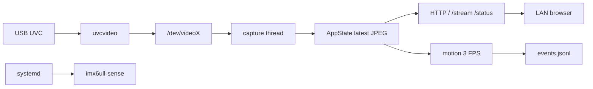

# i.MX6ULL Sense Terminal

A rebuildable MJPEG + motion + systemd service for NXP i.MX6ULL.

在野火 EBF6ULL S1 Pro 上，用 USB 摄像头做一件完整的事：

```text
UVC 摄像头 → V4L2 采集 → 浏览器看画面 → 检测运动并记日志 → systemd 一直跑着
```



这不是 uStreamer、mjpg-streamer 或 Motion 的封装。那些项目用来对照成熟软件如何划分采集、推流、事件和守护；最终在板上跑的、本仓库里读到的，是自己写的最小 daemon。这样你可以看懂每一段，也能在自己的硬件上从头做一遍。取舍见 [ADR-0001](docs/architecture/decisions/0001-use-uvc-first.md)、[ADR-0002](docs/architecture/decisions/0002-use-mjpeg-over-http.md)、[ADR-0003](docs/architecture/decisions/0003-build-minimal-daemon.md)。

## 你需要什么

- 野火 EBF6ULL S1 Pro，或同系列 i.MX6ULL 开发板
- Linux 免驱 USB UVC 摄像头
- Windows + WSL，用于交叉编译
- 开发板 USB OTG 数据线（默认 USB RNDIS；不要用板载 Wi-Fi，不要启用 `autowifi.service`）

涉及板级接线、USB、CSI 或设备树时，先查 [本地板级资料索引](docs/reference/hardware/local-board-documents.md)。厂商 PDF 不随仓库分发。

## 构建和运行

在克隆后的仓库根目录：

```sh
make -C app/daemon verify
./scripts/build-arm.sh
```

安装和启停见 [服务生命周期](docs/operations/runbooks/service-lifecycle.md)。从零开始见 [教程](docs/tutorials/getting-started.md)。

浏览器打开（板端地址以 `usb0` 为准，USB RNDIS 常见为 `192.168.7.2`）：

```text
http://192.168.7.2:8080/
```

从 WSL 访问时必须绕过代理：

```sh
curl --noproxy 192.168.7.2 http://192.168.7.2:8080/status
```

## 已经验证什么

数字来自板上验收，完整表见 [测试报告](docs/verification/test-report.md)。

| 项 | 结果 |
| --- | --- |
| 画面 | MJPG 640×480，单客户端 30 FPS，30 分钟 RSS 不涨 |
| 运动 | 3 FPS 灰度帧差；静止 5 分钟 0 误报，挥手 10/10 |
| 崩溃 | `kill -9` 后 systemd 拉起新进程 |
| 配错 | 退出码 78，不出现重启风暴 |
| 摄像头 | 拔掉后服务仍在（degraded），插回同一进程恢复 |
| 重启 | 无人登录即自启，JSONL 继续追加 |

## 按阶段学习

每一段都有阶段总结和当时的命令记录：

- [M0 环境与板端基线](docs/stage_summaries/M0_environment_and_board_baseline.md)
- [M1 USB UVC 首帧](docs/stage_summaries/M1_usb_uvc_camera_capture.md)
- [M2 浏览器 MJPEG](docs/stage_summaries/M2_mjpeg_browser_stream.md)
- [M3 motion 与 JSONL](docs/stage_summaries/M3_motion_event_logging.md)
- [M4 systemd 与故障注入](docs/stage_summaries/M4_systemd_fault_injection.md)
- [M5 测试报告与发布说明](docs/stage_summaries/M5_resume_demo_packaging.md)

## 做不到什么

- 只面向可信局域网，没有登录，没有 TLS
- 没有 H.264 / RTSP、录像、AI 检测，也没有把 OV5640 做成必选项
- 单客户端稳定性已验证，没有做多客户端压测
- `/dev/videoX` 编号会变；按 `uvcvideo` 和 Device Caps 选择节点
- `event_count` 是进程内计数；JSONL 在磁盘上继续追加

## 文档

| 我需要 | 入口 |
| --- | --- |
| 从零跑起来 | [教程](docs/tutorials/getting-started.md) |
| 系统怎么组成 | [架构](docs/architecture/overview.md) |
| 验收数字 | [测试报告](docs/verification/test-report.md) |
| 踩过的坑 | [Bug 复盘](docs/bug_reports/README.md) |
| 怎样演示 | [演示步骤](docs/presentation/demo-script.md) |
| 为什么这样实现 | [设计问答](docs/presentation/design-faq.md) |
| 如何改这个仓库 | [CONTRIBUTING](CONTRIBUTING.md) |
| 全部文档分类 | [docs/README.md](docs/README.md) |

## License

[MIT](LICENSE)
