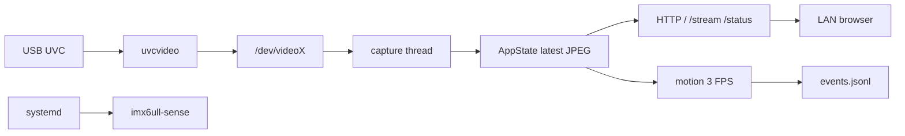

# i.MX6ULL Sense Terminal

运行在野火 EBF6ULL S1 Pro / i.MX6ULL 上的嵌入式 Linux 智能感知服务。

## MVP

```text
USB UVC 摄像头
  -> V4L2 采集
  -> MJPEG 浏览器预览
  -> motion event
  -> JSONL 事件日志
  -> systemd 与故障注入
```



项目参考 uStreamer、mjpg-streamer、Motion 和 v4l-utils 的工程取舍，但最终演示使用本仓库实现的最小 daemon。设计原因见 [ADR](docs/architecture/decisions/)。

## 当前状态

- M0 环境、交叉编译、部署和板端运行：已完成。
- M1 USB UVC 枚举、格式确认和 MJPG 首帧：已完成。
- M2 V4L2 MJPEG 采集与 HTTP stream：已完成并合入 `develop`。
- M3 motion event、JSONL 和状态接口：已完成并合入 `develop`。
- M4 systemd 与故障注入：已完成并合入 `develop`（PR #5）。
- M5 测试报告、Demo 和发布包装：文档已完成，等待提交和 PR。

当前分支：`codex/m5-docs-demo`。

功能闭环已在板上验收：MJPG 640x480@30、单客户端 30 分钟 30 FPS、motion 3 FPS、systemd 无人值守和故障注入。综合结论见 [测试报告](docs/verification/test-report.md)，演示步骤见 [Demo 脚本](docs/presentation/demo-script.md)。

## 仓库入口

| 内容 | 路径 |
| --- | --- |
| C daemon | `app/daemon/` |
| 配置 | `config/config.json` |
| 文档总入口 | [docs/README.md](docs/README.md) |
| 当前执行计划 | [docs/plans/current.md](docs/plans/current.md) |
| 系统架构 | [docs/architecture/overview.md](docs/architecture/overview.md) |
| 操作指南 | [docs/how-to/](docs/how-to/) |
| 服务生命周期 | [docs/operations/runbooks/service-lifecycle.md](docs/operations/runbooks/service-lifecycle.md) |
| 验收证据 | [docs/verification/evidence/](docs/verification/evidence/) |
| 阶段总结 | [docs/stage_summaries/](docs/stage_summaries/) |
| 学习型 Bug | [docs/bug_reports/](docs/bug_reports/) |
| 运行事故 | [docs/operations/postmortems/](docs/operations/postmortems/) |
| Demo / 面试 | [docs/presentation/](docs/presentation/) |
| systemd 模板 | `systemd/` |

## 当前硬件路线

MVP 使用 USB UVC 摄像头。OV5640 只在 UVC 闭环完成后作为可选 DVP/CSI 增强项，不阻塞 M0-M5。

涉及开发板接口、pinout、USB、CSI、时钟、电源或设备树时，先查 [本地板级资料索引](docs/reference/hardware/local-board-documents.md)，并以 EBF6ULL S1 Pro 原理图作为板级事实来源。

默认板端连接：USB RNDIS `debian@192.168.7.2`。不要启用 `autowifi.service`。

## 正式运行

安装和启停见 [服务生命周期](docs/operations/runbooks/service-lifecycle.md)。浏览器打开：

```text
http://192.168.7.2:8080/
```

从 WSL 检查状态时必须绕过代理：

```sh
curl --noproxy 192.168.7.2 http://192.168.7.2:8080/status
```

## 已知限制

- 只面向可信局域网，无认证、无 TLS。
- 单客户端稳定性已验证，未做多客户端压力测试。
- `/dev/videoX` 编号会变；按 `uvcvideo` 和 Device Caps 选择节点。
- `event_count` 是进程内计数；JSONL 在磁盘上继续追加。
- 板载 Wi-Fi 不是部署路径。

完整列表见 [测试报告](docs/verification/test-report.md)。

## 记录规则

- 每个阶段的真实命令和输出放在 `docs/verification/evidence/`。
- 每个完成阶段在 `docs/stage_summaries/` 保存结论和证据链接。
- 值得复盘的搭建或调试问题进入 `docs/bug_reports/`。
- 正式运行中产生实际影响的事故进入 `docs/operations/postmortems/`。
- 当前顺序只在 `docs/plans/current.md` 维护，路线原因写 ADR。
