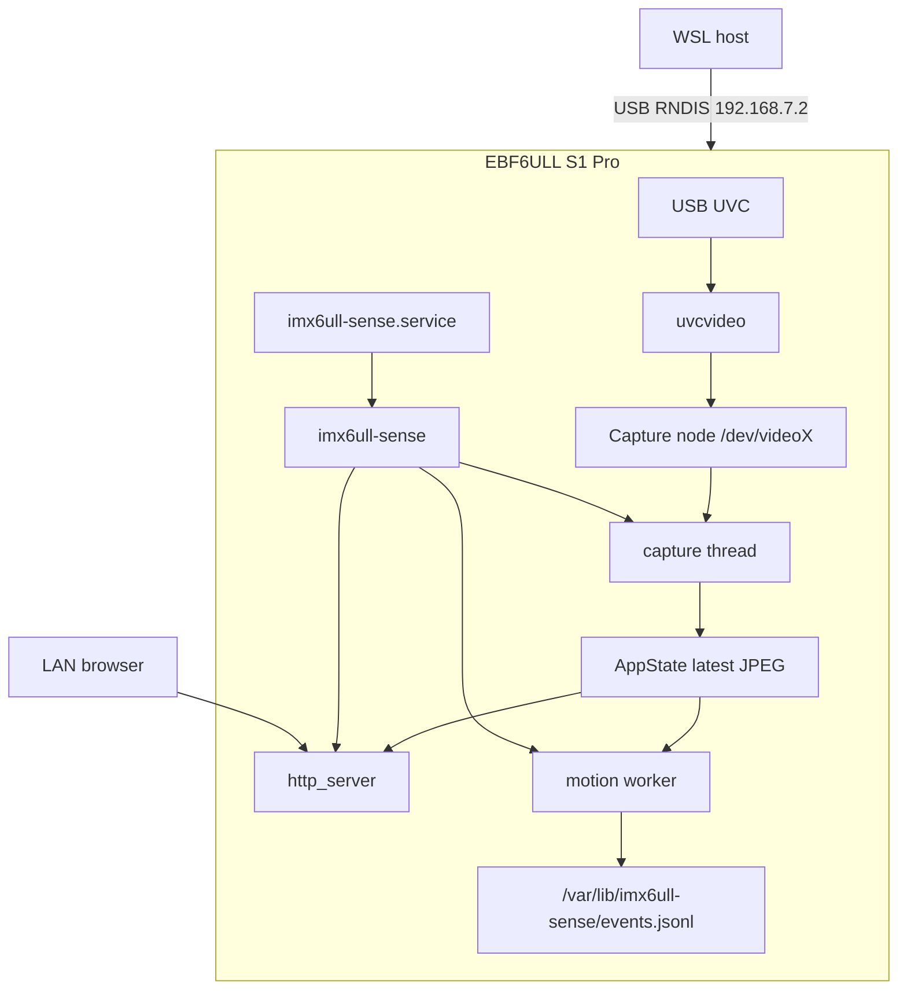

# 系统架构总览

## 当前边界

项目运行在野火 EBF6ULL S1 Pro / i.MX6ULL 开发板上。M0-M5 的落地主链路是：

```text
USB UVC 摄像头
  -> Linux uvcvideo
  -> /dev/videoX
  -> V4L2 MMAP 采集线程
  -> AppState 中的最新 JPEG 帧
       ├─ HTTP multipart MJPEG -> PC 浏览器
       └─ 3 FPS 抽样 -> libjpeg 1/4 灰度解码
                    -> 帧差 + threshold + cooldown
                    -> JSONL event log + /status
```



开发、交叉编译和部署由 WSL 主机完成，主机与开发板默认通过 USB RNDIS `192.168.7.2` 通信。

## 当前实现

- USB UVC MJPEG 输入。
- V4L2 MMAP 连续采集。
- 单进程、多线程 daemon。
- 共享最新帧，不保存历史帧队列。
- `GET /`、`GET /stream`、`GET /status`。
- 摄像头不可用时进入 degraded 状态并重试。
- JPEG 低频灰度解码和逐像素帧差。
- threshold、cooldown、JSONL 事件追加写入。
- `/status` 输出真实 health、camera/event_log 状态、motion、score、采样 FPS 和事件计数。
- systemd 安装、开机自启、崩溃恢复和配置错误 fail-safe。

当前实现不包含 YUYV 软件 JPEG 编码或 OV5640 CSI 适配。

## 目标闭环

```text
M2 浏览器 MJPEG（Completed）
  -> M3 motion event + JSONL（Completed）
  -> M4 systemd + 故障注入（Completed）
  -> M5 演示、测试报告和发布包装（Completed，待合入 develop）
```

OV5640 是 UVC MVP 完成后的可选增强项，不进入当前关键路径。

## 外部角色

| 角色或系统 | 作用 |
| --- | --- |
| USB UVC 摄像头 | 提供 MJPEG/YUYV 视频能力 |
| Linux 内核与 `uvcvideo` | 暴露 V4L2 设备节点 |
| `imx6ull-sense` | 采集、状态管理、HTTP 和 motion/event |
| 浏览器或 `curl` | 消费页面、视频流和状态接口 |
| WSL 开发主机 | 构建、部署、验证和保存文档证据 |
| systemd | 启动、崩溃恢复、开机自启和 journal |

## 事实来源

- 当前执行顺序：[当前计划](../plans/current.md)
- 模块职责：[组件说明](components.md)
- 线程和数据流：[运行时说明](runtime.md)
- 主机与板端关系：[部署说明](deployment.md)
- 设计取舍：[ADR](decisions/)
- 实际验收证据：[verification/evidence](../verification/evidence/)
- 综合结论：[测试报告](../verification/test-report.md)
